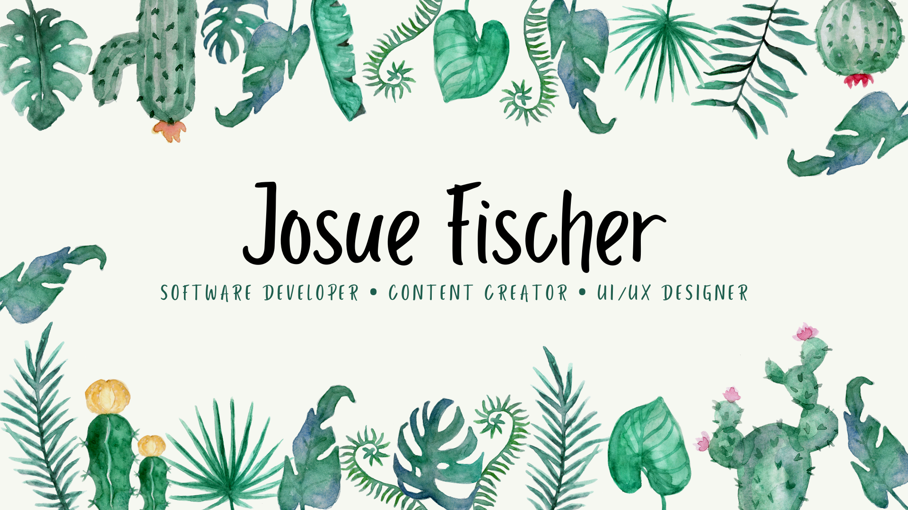

 

# Hey! I´m Josue Fischer.

 

# I design and program beautiful and simple things, and I love what I do.

I am a software developer with a passion for building beautiful and simple things, i love what I do and I am always looking for new ways to improve my skills.

 

 

# My skills

## Designer:
I design interfaces and user experiences, flyers, posters, invitations and product designs. I value simple content structure, clean design patterns, and well-thought-out interactions. Things I enjoy designing: UX, UI, websites, mobile apps, logos.

## Software Developer:
I develop web pages, ideal for your portfolio, business or enterprise. I like to code things from scratch and enjoy bringing ideas to life in the browser. Languages I speak: HTML, CSS, JavaScript, Python, Java.

## ¿Want to contact me?

_My e-mail:_
josuefischercraft@gmail.com

 

## Technologies and software i use

<code></code>
<code></code>
<code></code>
<code></code>
<code></code>
<code></code>
<code></code>
<code></code>
<code></code>
<code></code>
<code></code>
